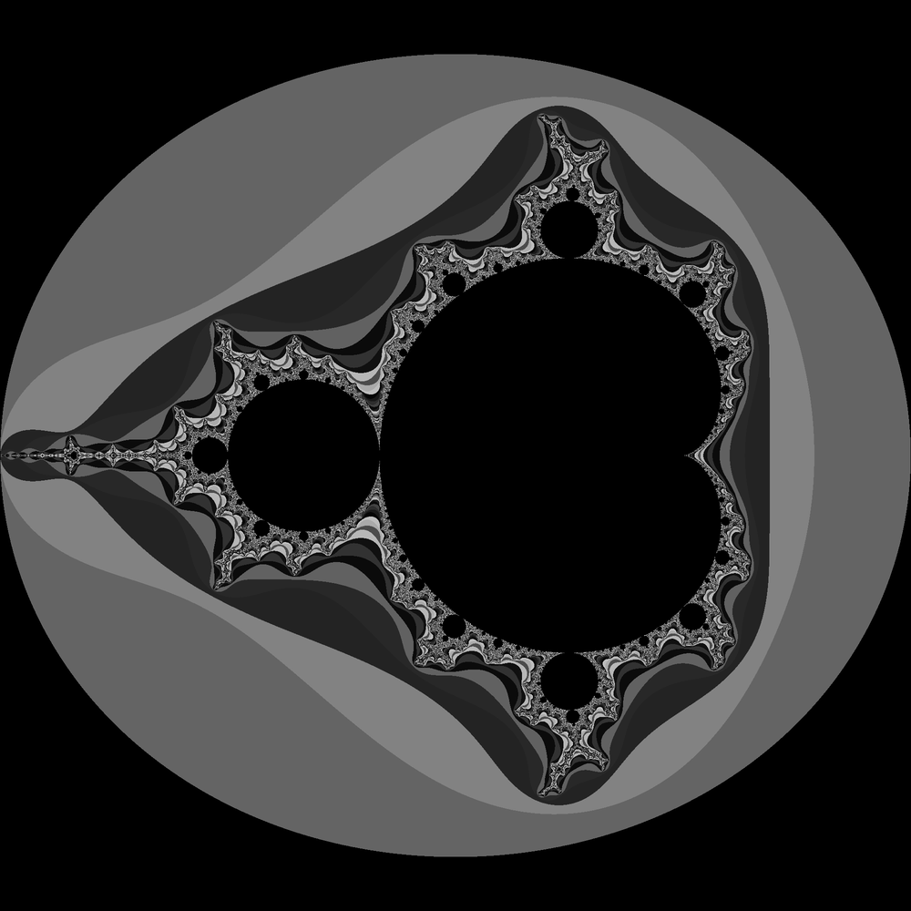
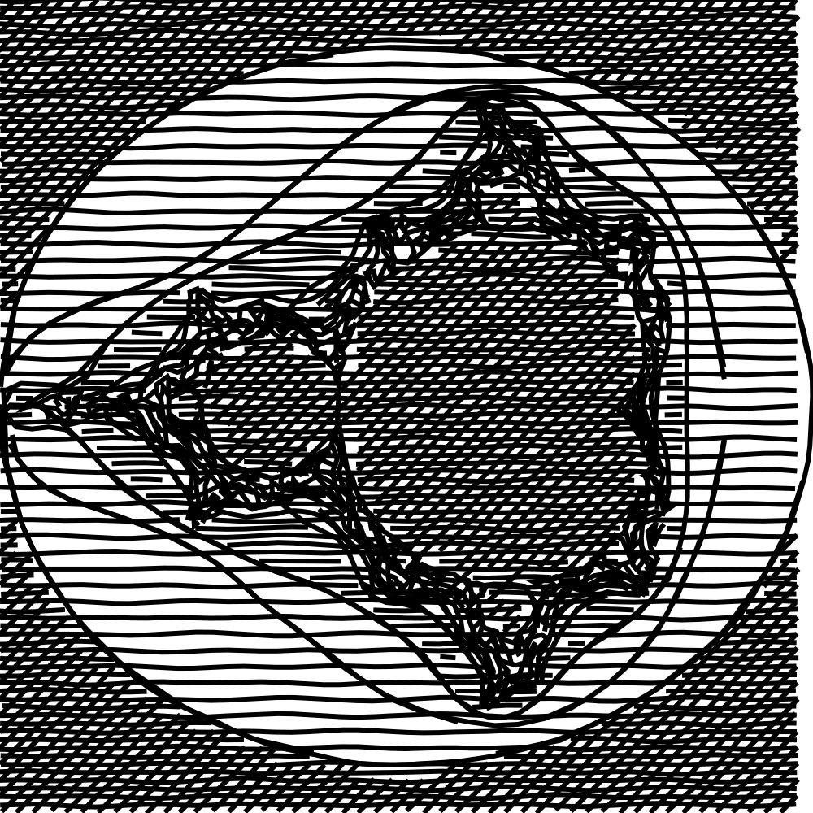
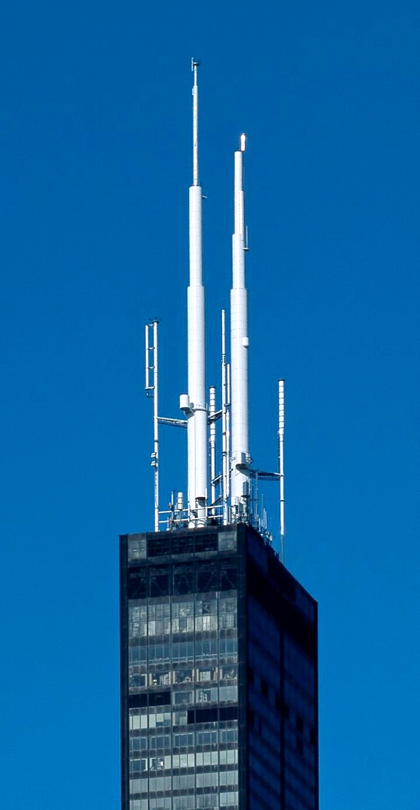
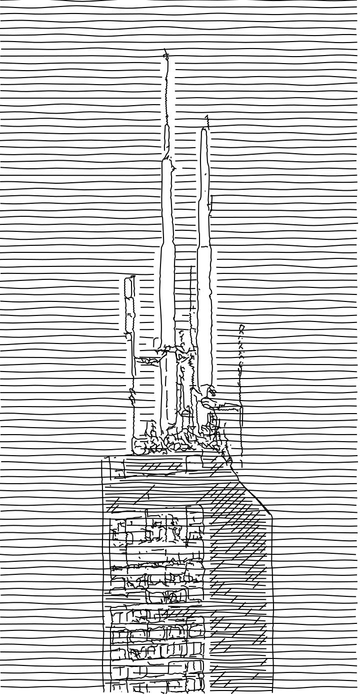

= linedraw
Mykolas Bamberg <m.a.bamberg.dev@proton.me>
:source-highlighter: pygments
:hide-uri-scheme:
:hardbreaks-option:

https://github.com/LingDong-/linedraw[`LingDong-/linedraw`] algorithm implemented in D

== Usage

----
    ./linedraw [OPTION]... INPUT OUTPUT

Arguments:
-c  --contour Contour detail, 0 to disable
-s    --hatch Hatch scale, 0 to disable
-n    --noise Noise scale, 0 to disable
-w    --width Stroke width
-o --optimize Optimize Route
-h     --help This help information.
----

== Build

https://wiki.dlang.org/LDC[LDC] / https://wiki.dlang.org/DMD[DMD] and https://dub.pm/[DUB] are required.

[source,bash]
----
$ dub build --compiler=ldc2 -f -b release-nobounds
----

== Examples

[source,bash]
----
$ ./linedraw -o -s 20 -c 20 -n 4 test_images/mandelbrot.bmp test_images/mandelbrot.svg
----

[cols="1a,1a",frame=none,grid=none]
|===
|*Source*

|*Traced*

|===

[source,bash]
----
$ ./linedraw -c 5 -n 4 -w 2 -s 14 -o test_images/antennas.png test_images/antennas.svg
----

[cols="1a,1a",frame=none,grid=none]
|===
|*Source*

|*Traced*

|===
